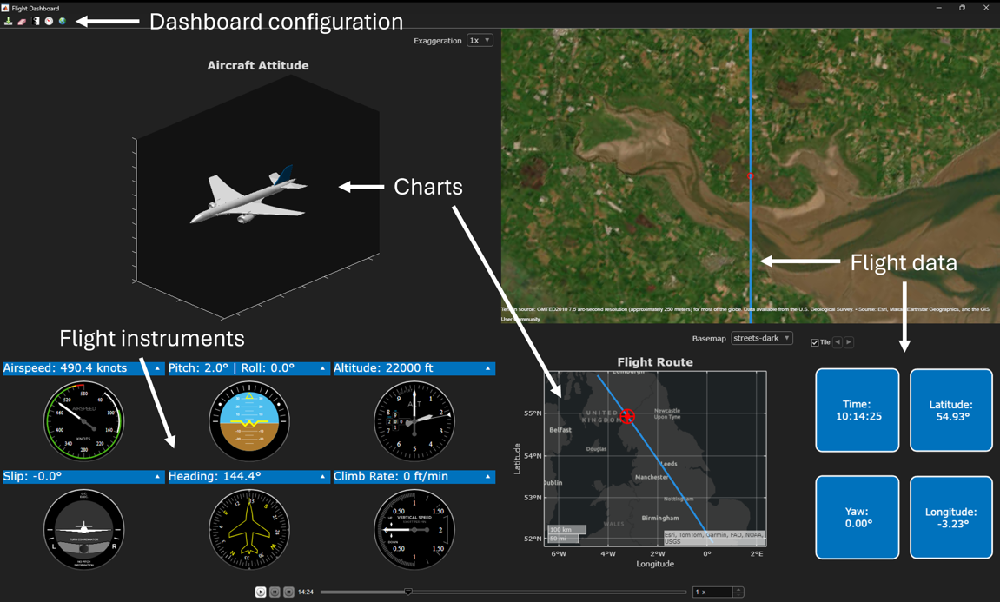

# Creating a Flight Tracking Dashboard

This repository contains the MATLAB® code for the series of articles on [_Creating a Flight Tracking Dashboard_](https://blogs.mathworks.com/graphics-and-apps/2024/02/08/creating-a-flight-tracking-dashboard-part-1-visualizing-an-aircraft/), available under the [MATLAB Graphics and App Building](https://blogs.mathworks.com/graphics-and-apps/) blog.

MATLAB provides a large suite of visualization functions tailored to scientific and engineering applications. 
In addition, MATLAB enables you to develop domain-specific visualizations. 
These can be embedded in all data analytics workflows, ranging from small-scale 
interactive [tasks](https://www.mathworks.com/help/releases/R2024b/matlab/develop-live-editor-tasks.html) 
to more complex [reports](https://www.mathworks.com/products/matlab-report-generator.html), 
[apps](https://www.mathworks.com/products/matlab/app-designer.html) and 
[web apps](https://www.mathworks.com/products/matlab-web-app-server.html) 
such as dashboard-like front ends.

## Installation and Getting Started
The examples are provided as a [MATLAB toolbox](https://www.mathworks.com/help/matlab/matlab_prog/create-and-share-custom-matlab-toolboxes.html).

1. Download the toolbox installer (the `Flight_Tracking_Dashboard.mltbx` file) from the `Releases` section on GitHub.
2. Double-click on the `Flight_Tracking_Dashboard.mltbx` file to install the toolbox.
3. Run `>> FlightDashboardApp` to launch the application. 

## [MathWorks](https://www.mathworks.com) Product Requirements

These examples require MATLAB R2024b or a later release.
- [MATLAB&reg;](https://www.mathworks.com/products/matlab.html)
- [Aerospace Toolbox&trade;](https://www.mathworks.com/products/aerospace-toolbox.html)
- [Mapping Toolbox&trade;](https://www.mathworks.com/products/mapping.html)

### Required Add-Ons
- [GUI Layout Toolbox](https://www.mathworks.com/matlabcentral/fileexchange/47982-gui-layout-toolbox)

## License
The license is available in the [LICENSE.txt](LICENSE.txt) file in this GitHub repository.

Copyright 2024-2026 The MathWorks, Inc.

## Community Support
[MATLAB Central](https://www.mathworks.com/matlabcentral)
